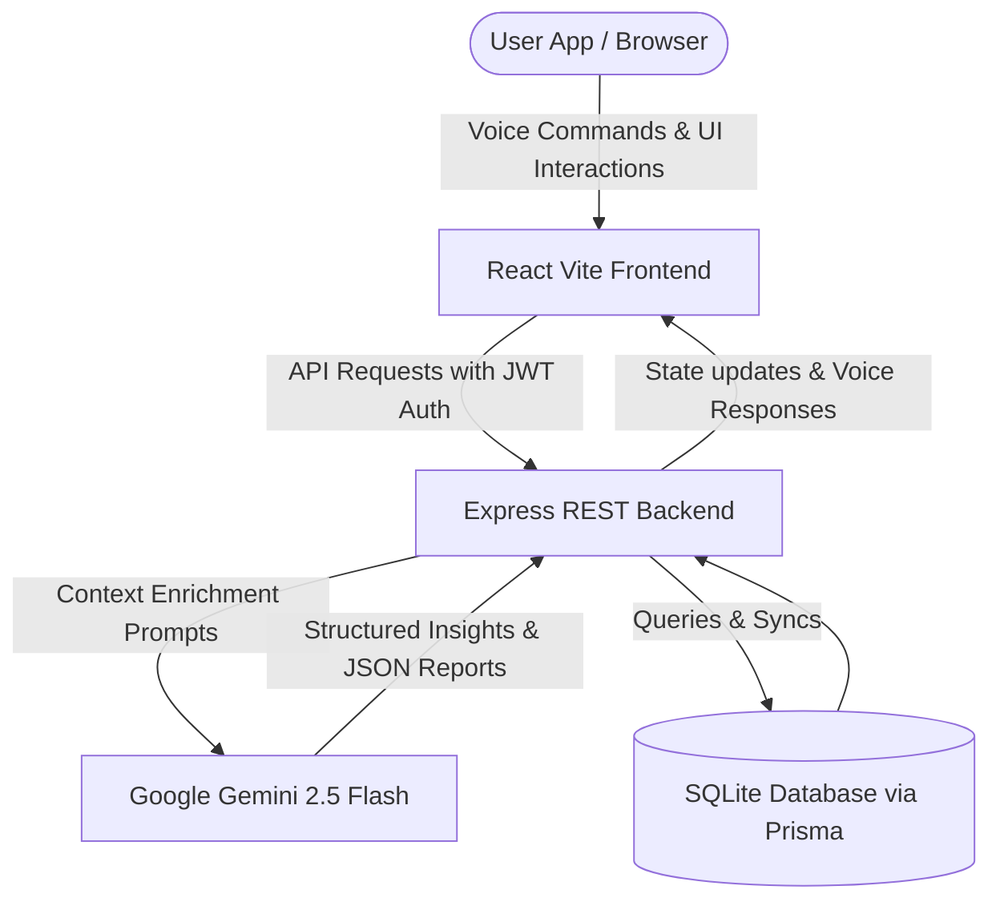

# 🩺 HealthOS - An AI-Powered Preventive Health Operating System

[](https://www.typescriptlang.org/)
[](https://reactjs.org/)
[](https://www.prisma.io/)
[](https://sqlite.org/)
[](https://ai.google.dev/)

HealthOS is a state-of-the-art, AI-powered preventive health platform designed to transform clinical diagnostic data, daily lifestyles, and laboratory reports into actionable longevity protocols. Built with a full-stack architecture leveraging **React (Vite)**, **Express (Node.js)**, **Prisma (SQLite)**, and **Google Gemini 2.5 Flash**, HealthOS acts as a patient's personal preventive health copilot and a physician's digital workspace.

---

## 🌟 Hackathon-Winning Features

### 1. 🧬 AI Biological Longevity Clock
- Computes biological age based on chronological profile, BMI, sleep, water, and exercise metrics.
- Computes life expectancy impact and provides a tailored risk category classification.

### 2. 🩻 Automated Radiology Summarizer
- Accepts raw clinical transcripts or radiology imaging findings (X-Rays, MRIs, CT Scans).
- Automatically translates complex jargon into a patient-friendly 4-point summary: *What is it*, *Clinical severity*, *Critical parameters*, and *Recommended next steps*.

### 🔬 Lab Biomarkers Image & PDF Clinical Analyzer
- **Multimodal File Upload Support**: Users can upload laboratory reports as images (`.png`, `.jpg`, `.jpeg`) or PDF files (`.pdf`).
- **Clinical Flag Highlights**: Automatically extracts biomarkers (HbA1c, Lipids, Creatinine, TSH) and highlights out-of-range parameters (High/Borderline/Normal) with customized action steps.

### 🎙️ Hands-Free Voice AI Navigation Assistant
- Integrates fully hands-free voice control directly into the workspace.
- **Voice Commands**:
  - *"Navigate to logs"* / *"Go to chat"* (Instant tab redirection)
  - *"Set weight to 72"* / *"Log water 3 liters"* (Voice vitals updates)
  - *"Help me, dispatch SOS alert"* (SOS Red Alert activation)
- **Conversational Speech Fallback**: Speaks queries aloud with built-in voice feedback.

### 🔔 Witty Zomato-Style Push Notifications Feed
- Replaces dry notifications with spicy, witty, and humorous Hinglish push alerts.
- **Roast Categories**:
  - `Reality Check ⚠️`: *"Ghutne bolenge 'Bye Bye' 60 se pehle! Walk target complete karo."*
  - `Spicy Advice 🌶️`: *"Paani nahi pee rahe? Jaldi budhe ho jaoge! Chupchaap 1 glass piyo."*
  - `Sleep Roast 😴`: *"Oye sleep-deprived human! Der raat scrolling band karo."*
  - `Diet Roast 🥗`: *"Diet me momos, aur sapne zero cholesterol ke?"*

### 🩺 Physician AI Co-Pilot & EHR Synthesizer
- A secure workspace for doctors to record consults.
- Generates structured clinical outputs:
  - **SOAP Notes**: Subjective, Objective, Assessment, and Plan formatting.
  - **ICD-10 Diagnostic Coders**: Auto-maps symptoms to official clinical codes.
  - **Prescription Composer**: Drafts medicines with dosage schedules.

### 📊 Population Demographics & CSV Exports
- Administrative panel summarizing global patient statistics.
- Generates cohort risk distributions for metabolic disease, CKD risk, and stress.
- Support for **one-click Excel/CSV population exports** for public health reporting.

### 🚨 SOS Red Alert Dispatch
- Instant paramedic dispatch brief generation for clinical emergencies (Stroke/Paralysis, Heart Attack, ACUTE Trauma).

---

## 🛠️ Architecture and Data Flow



---

## ⚙️ Setup and Installation

### Prerequisites
- **Node.js** (v18.x or above)
- **npm** (v9.x or above)

### 1. Clone & Install Dependencies
```bash
npm install
```

### 2. Configure Environment Variables
Create a `.env` file in the root directory:
```env
PORT=5000
DATABASE_URL="file:./dev.db"
JWT_SECRET="your-super-secret-jwt-key"
GEMINI_API_KEY="your-google-gemini-api-key"
GEMINI_MODEL="gemini-2.5-flash"
```

### 3. Database Migration
Initialize the SQLite database with the Prisma schema:
```bash
npx prisma db push
```

### 4. Run Development Servers
Start both the Vite dev server and the CJS Express API backend:
```bash
npm run dev
```
Open your browser and navigate to: **`http://localhost:5173`**

---

## 📡 REST API Documentation

| Method | Endpoint | Description | Payload Parameter |
| :--- | :--- | :--- | :--- |
| **POST** | `/api/auth/register` | Register a new patient/doctor | `{ email, password, role }` |
| **POST** | `/api/auth/login` | Login and receive JWT token | `{ email, password }` |
| **POST** | `/api/profile` | Save/Update health profile vitals | `{ age, height, weight, cuisine, budget, equipment }` |
| **GET** | `/api/profile` | Fetch patient's biological metrics | *Headers: Authorization Bearer* |
| **POST** | `/api/logs` | Log daily water, exercise, sleep, meals | `{ weight, sleep, exercise, water, meals, mood }` |
| **GET** | `/api/logs` | Retrieve daily health tracking history | *Headers: Authorization Bearer* |
| **POST** | `/api/lab/analyze` | Analyze lab report (text or base64 file) | `{ labText, imageBase64 }` |
| **POST** | `/api/vision/analyze-meal` | Run food photo macros/calories verdict | `{ imageBase64, mealDescription }` |
| **POST** | `/api/chat` | Send conversational query to AI Companion | `{ message, language }` |
| **GET** | `/api/notifications`| Fetch witty Zomato-style daily notifications | *Headers: Authorization Bearer* |
| **GET** | `/api/reports` | Compile and retrieve Weekly Reports | *Headers: Authorization Bearer* |
| **GET** | `/api/admin/stats` | Retrieve administrative demographics statistics | *Headers: Authorization Bearer (Admin)* |

---

## 🧪 Testing & Lint Verification
To check TypeScript compiler and formatting configurations, run:
```bash
# Run TypeScript Compiler checks
npm run lint

# Compile production build
npm run build
```

---

## 📜 Medical Disclaimer
This software platform is built for educational, hackathon demonstration, and health-preventive optimization purposes. It is **not** a certified medical diagnostic device. Please consult a qualified clinical physician for official medical diagnoses, treatments, or prescriptions.
